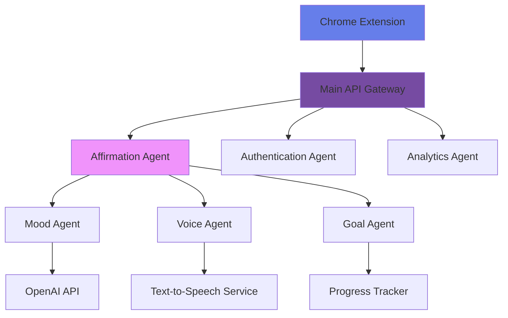

# Cosmic Tab Coach Backend API

Database-powered backend for the Cosmic Tab Coach Chrome extension, enabling personalization, analytics, and premium features.

## 🚀 Features

- **Privacy-First**: Anonymous user system, no personal data collection
- **Real-time Sync**: Cross-device preference synchronization
- **AI Integration**: Ready for OpenAI integration for personalized content
- **A2A Protocol Support**: Multi-agent architecture using Google's Agent-to-Agent protocol
- **Social Authentication**: Google, Reddit, and other OAuth providers
- **Analytics**: Usage tracking for personalization without privacy invasion
- **Scalable**: Built with FastAPI and PostgreSQL via Supabase

## 🛠️ Tech Stack

- **Framework**: FastAPI (Python)
- **Database**: PostgreSQL (via Supabase)
- **Authentication**: Anonymous UUID-based system + OAuth (Google, Reddit)
- **Package Manager**: uv (as per your preference)
- **Multi-Agent**: Google's A2A Protocol for agent interoperability
- **Deployment**: Ready for Railway, Vercel, or any platform

## 🤖 Multi-Agent Architecture with A2A

Cosmic Tab Coach is designed as a **multi-agent system** using Google's Agent-to-Agent (A2A) protocol. This enables specialized AI agents to collaborate and provide personalized experiences.

### 🌐 What is A2A?

The **Agent2Agent (A2A) Protocol** is Google's open standard for AI agent interoperability, announced in April 2025. It allows AI agents to:

- **Communicate across platforms** (vendor-agnostic)
- **Discover each other's capabilities** dynamically
- **Collaborate on complex tasks** securely
- **Handle long-running processes** with real-time updates
- **Exchange multi-modal content** (text, audio, images, data)

### 🎯 Why A2A for Cosmic Tab Coach?

Our roadmap includes many specialized agents:

| Agent Type | Purpose | A2A Integration |
|------------|---------|-----------------|
| **Affirmation Generator** | AI-powered personalized affirmations | ✅ Core agent |
| **Mood Analyzer** | Detect user emotional state | ✅ Collaborates with Affirmation Generator |
| **Voice Synthesizer** | Convert text to soothing voice | ✅ Called by Affirmation Generator |
| **Breathing Coach** | Guided breathing exercises | ✅ Independent but coordinated |
| **Goal Tracker** | Personal growth goals | ✅ Informs other agents |
| **Community Manager** | Mindfulness circles | ✅ Multi-user coordination |

### 🔄 A2A Communication Flow



### 🛠️ A2A Implementation

Each agent in our system implements the A2A protocol:

1. **Agent Card** - Publishes capabilities at `/.well-known/agent.json`
2. **Task Management** - Handles stateful interactions
3. **Message Exchange** - Structured communication between agents
4. **Security** - Enterprise-grade authentication

### 🌟 Current A2A Agents

#### 1. **Affirmation Generation Agent**
```http
GET /.well-known/agent.json
```
```json
{
  "name": "Cosmic Affirmation Generator",
  "skills": [
    {
      "id": "generate_personalized_affirmation",
      "description": "Create AI-powered affirmations based on user mood, goals, and preferences"
    },
    {
      "id": "categorize_affirmation",
      "description": "Classify affirmations into cosmic themes"
    }
  ],
  "authentication": {"schemes": ["bearer"]},
  "capabilities": {"streaming": true}
}
```

#### 2. **Social Authentication Agent**
```json
{
  "name": "Cosmic Social Auth",
  "skills": [
    {
      "id": "google_oauth",
      "description": "Handle Google sign-in for enhanced personalization"
    },
    {
      "id": "reddit_oauth", 
      "description": "Reddit integration for community features"
    }
  ]
}
```

### 🚀 Future A2A Roadmap

**Q1 2025:**
- Mood-Aware AI Agent
- Voice Affirmation Agent
- Smart Break Reminder Agent

**Q2 2025:**
- Breathing Coach Agent
- Ambient Soundscape Agent
- Gratitude Journal Agent

**Q3 2025:**
- Focus Shield Agent
- Circadian Sync Agent
- Cross-Platform Sync Agent

**Q4 2025:**
- Community Circle Agent
- Custom Affirmation Creator Agent
- Global Impact Analytics Agent

### 📚 A2A Resources

- **Official Spec**: [A2A Protocol on GitHub](https://github.com/google-a2a/A2A)
- **Google Announcement**: [A2A Developer Blog](https://developers.googleblog.com/en/a2a-a-new-era-of-agent-interoperability/)
- **Industry Partners**: 50+ companies including Atlassian, Box, Salesforce, SAP
- **Complements**: Works alongside Anthropic's MCP (Model Context Protocol)

### 💡 A2A Use Case Examples

#### 1. **User Adds Custom Affirmation with AI Enhancement**

```python
# User creates affirmation via Chrome extension
# Main gateway receives request and delegates to agents

async def handle_custom_affirmation(user_input: str, user_id: str):
    # Step 1: Auth agent validates user
    auth_response = await a2a_client.send_task(
        agent="auth-agent",
        task={
            "skill": "validate_user",
            "input": {"user_id": user_id}
        }
    )
    
    # Step 2: Affirmation agent enhances the text
    enhanced = await a2a_client.send_task(
        agent="affirmation-agent", 
        task={
            "skill": "enhance_user_affirmation",
            "input": {
                "raw_text": user_input,
                "user_preferences": auth_response.preferences
            }
        }
    )
    
    # Step 3: Analytics agent tracks creation
    await a2a_client.send_task(
        agent="analytics-agent",
        task={
            "skill": "track_event",
            "input": {
                "event": "custom_affirmation_created",
                "user_id": user_id,
                "metadata": {"enhanced": True}
            }
        }
    )
    
    return enhanced
```

#### 2. **Social Sign-In with Cross-Agent Coordination**

```python
# Google sign-in triggers multiple agent interactions

async def handle_google_signin(google_token: str):
    # Auth agent handles OAuth
    auth_result = await a2a_client.send_task(
        agent="auth-agent",
        task={
            "skill": "google_oauth",
            "input": {"token": google_token}
        }
    )
    
    # Analytics agent gets user's affirmation history
    history = await a2a_client.send_task(
        agent="analytics-agent",
        task={
            "skill": "get_user_insights",
            "input": {"user_id": auth_result.user_id}
        }
    )
    
    # Affirmation agent personalizes content
    personalized = await a2a_client.send_task(
        agent="affirmation-agent",
        task={
            "skill": "personalize_for_new_user",
            "input": {
                "user_profile": auth_result.profile,
                "usage_history": history.insights
            }
        }
    )
    
    return {
        "user": auth_result.user,
        "personalized_content": personalized.affirmations
    }
```

#### 3. **AI-Generated Mood-Based Affirmations**

```python
# Morning affirmation request with mood detection

async def generate_morning_affirmation(user_id: str, context: dict):
    # Mood agent analyzes user context (time, weather, recent activity)
    mood_analysis = await a2a_client.send_task(
        agent="mood-agent",
        task={
            "skill": "analyze_user_state",
            "input": {
                "user_id": user_id,
                "time_of_day": context.get("time"),
                "recent_activity": context.get("recent_browsing"),
                "weather": context.get("weather")
            }
        }
    )
    
    # Goal agent provides current user goals
    goals = await a2a_client.send_task(
        agent="goal-agent", 
        task={
            "skill": "get_active_goals",
            "input": {"user_id": user_id}
        }
    )
    
    # Affirmation agent generates personalized content
    affirmation = await a2a_client.send_task(
        agent="affirmation-agent",
        task={
            "skill": "generate_ai_affirmation",
            "input": {
                "mood": mood_analysis.detected_mood,
                "energy_level": mood_analysis.energy,
                "goals": goals.active_goals,
                "preferred_themes": goals.preferred_categories
            }
        }
    )
    
    # Voice agent optionally adds audio
    if user_preferences.voice_enabled:
        audio = await a2a_client.send_task(
            agent="voice-agent",
            task={
                "skill": "text_to_speech",
                "input": {
                    "text": affirmation.text,
                    "voice_style": "calming",
                    "background": "nature_sounds"
                }
            }
        )
        affirmation.audio_url = audio.url
    
    return affirmation
```

## 📋 Quick Setup

### 1. Install Dependencies

```bash
# Using uv (your preferred tool)
uv sync

# Or with pip
pip install -r requirements.txt
```

### 2. Set Up Supabase

1. Go to [supabase.com](https://supabase.com) and create a new project
2. Copy your project URL and anon key
3. Run the database schema:
   ```sql
   -- Copy and paste the contents of database_schema.sql
   -- into your Supabase SQL editor
   ```

### 3. Environment Configuration

```bash
# Copy environment template
cp .env.example .env

# Edit .env with your Supabase credentials
SUPABASE_URL=https://your-project.supabase.co
SUPABASE_ANON_KEY=your-anon-key
```

### 4. Run the Server

```bash
# Development server
uv run uvicorn main:app --reload

# Production server
uv run uvicorn main:app --host 0.0.0.0 --port 8000
```

## 🔗 Chrome Extension Integration

### Update Extension Manifest

Add your API endpoint to the extension's `manifest.json`:

```json
{
  "host_permissions": [
    "https://your-api-domain.com/*"
  ]
}
```

### Extension API Client

Add this to your extension's JavaScript:

```javascript
// extension/js/api-client.js
class CosmicAPI {
    constructor() {
        this.baseUrl = 'https://your-api-domain.com';
        this.userId = null;
    }

    async init() {
        // Get or create anonymous user
        const stored = await chrome.storage.local.get(['cosmic_user_id']);
        
        if (stored.cosmic_user_id) {
            this.userId = stored.cosmic_user_id;
        } else {
            const response = await fetch(`${this.baseUrl}/auth/anonymous`, {
                method: 'POST'
            });
            const data = await response.json();
            this.userId = data.user_id;
            await chrome.storage.local.set({ cosmic_user_id: this.userId });
        }
    }

    async getPersonalizedAffirmations(limit = 10) {
        const response = await fetch(
            `${this.baseUrl}/affirmations/personalized/${this.userId}?limit=${limit}`
        );
        return response.json();
    }

    async updatePreferences(preferences) {
        const response = await fetch(
            `${this.baseUrl}/preferences/${this.userId}`, {
            method: 'PUT',
            headers: { 'Content-Type': 'application/json' },
            body: JSON.stringify(preferences)
        });
        return response.json();
    }

    async trackUsage(eventType, affirmationId = null, metadata = {}) {
        await fetch(`${this.baseUrl}/usage/track`, {
            method: 'POST',
            headers: { 'Content-Type': 'application/json' },
            body: JSON.stringify({
                user_id: this.userId,
                event_type: eventType,
                affirmation_id: affirmationId,
                metadata
            })
        });
    }

    async getAnalytics() {
        const response = await fetch(`${this.baseUrl}/analytics/${this.userId}`);
        return response.json();
    }
}

// Initialize API client
const cosmicAPI = new CosmicAPI();
```

### Updated Affirmation Manager

Modify your existing affirmation manager to use the API:

```javascript
// extension/js/affirmation-manager.js (add to existing)
class AffirmationManager {
    constructor() {
        // ... existing code ...
        this.api = new CosmicAPI();
    }

    async init() {
        await this.api.init();
        // ... existing initialization code ...
    }

    async getPersonalizedAffirmation() {
        try {
            const result = await this.api.getPersonalizedAffirmations(1);
            if (result.affirmations.length > 0) {
                const affirmation = result.affirmations[0];
                await this.api.trackUsage('viewed', affirmation.id);
                return affirmation;
            }
        } catch (error) {
            console.log('Using offline affirmations');
        }
        
        // Fallback to local affirmations
        return this.getRandomAffirmation();
    }

    async markAsFavorite(affirmation) {
        await this.api.trackUsage('liked', affirmation.id);
        // ... existing favorite logic ...
    }
}
```

## 📊 Database Schema Overview

### Core Tables
- **user_preferences**: Anonymous user settings and preferences
- **affirmations**: Custom and AI-generated affirmations
- **usage_events**: Analytics data for personalization
- **user_favorites**: User's favorite affirmations

### Future Tables (Roadmap)
- **ai_learning_data**: AI personalization patterns
- **premium_subscriptions**: Premium feature access
- **mindfulness_circles**: Community features

## 🔒 Privacy & Security

- **Anonymous Users**: No email, name, or personal data required
- **UUID-based**: Each user gets a random UUID for identification
- **Row-Level Security**: Users can only access their own data
- **Local-First**: Extension works offline, syncs when online
- **GDPR Compliant**: Easy data deletion and export

## 🚀 Deployment Options

### Railway (Recommended)
```bash
# Connect your GitHub repo to Railway
# Set environment variables in Railway dashboard
# Deploy automatically on git push
```

### Vercel
```bash
npm install -g vercel
vercel --prod
```

### Digital Ocean App Platform
```bash
# Connect GitHub repo
# Set environment variables
# Auto-deploy on push
```

## 📈 Scaling Strategy with A2A

### Phase 1: Foundation (Current)
- **Core API**: Anonymous users, preferences sync, usage analytics
- **Affirmation Agent**: AI-powered personalized content generation
- **Auth Agent**: Google & Reddit OAuth integration
- **Database Agent**: Supabase integration with row-level security

### Phase 2: Specialized Agents (Q1-Q2 2025)
- **Mood-Aware Agent**: Emotional state detection and response
- **Voice Agent**: Text-to-speech with soothing soundscapes
- **Breathing Coach Agent**: Guided breathing exercises with visual cues
- **Goal Tracker Agent**: Personal growth goal management
- **Smart Break Agent**: AI-powered break timing recommendations

### Phase 3: Advanced Wellness (Q3 2025)
- **Focus Shield Agent**: Gentle intervention for distracting websites
- **Circadian Agent**: Content adaptation to natural sleep-wake cycles
- **Analytics Agent**: Advanced mindful browsing insights
- **Micro-Meditation Agent**: Short guided meditation sessions

### Phase 4: Community & Global Impact (Q4 2025)
- **Community Circle Agent**: Private group mindfulness challenges
- **Custom Creator Agent**: AI-assisted user-generated affirmations
- **Global Impact Agent**: Collective positive impact visualization
- **Cross-Platform Agent**: Seamless sync across all devices

### 🔧 A2A Agent Development Pattern

Each new agent follows this pattern:

1. **Design Agent Card** (`/.well-known/agent.json`)
2. **Implement A2A Endpoints** (`/message/send`, `/message/stream`)
3. **Register with Main Gateway** (discovery and routing)
4. **Add Authentication** (OAuth, API keys)
5. **Test Inter-Agent Communication**
6. **Deploy as Microservice**

This modular approach means:
- ✅ **Rapid Development**: New agents can be built independently
- ✅ **Easy Scaling**: Each agent can scale based on demand  
- ✅ **Vendor Flexibility**: Mix and match best-in-class AI services
- ✅ **Fault Tolerance**: Agent failures don't break the entire system

## 🧪 Testing

```bash
# Run tests
uv run pytest

# Test API endpoints
curl http://localhost:8000/health
```

## 📝 API Documentation

When running the server, visit:
- **Interactive Docs**: http://localhost:8000/docs
- **OpenAPI Schema**: http://localhost:8000/openapi.json

## 🤝 Contributing

1. Fork the repository
2. Create a feature branch
3. Make your changes
4. Run tests
5. Submit a pull request

## 📞 Support

- **Email**: hello@cosmic-tab-coach.com
- **GitHub Issues**: For bug reports and feature requests
- **Documentation**: Additional docs at cosmic-tab-coach.netlify.app

---

Built with ❤️ for mindful browsing experiences